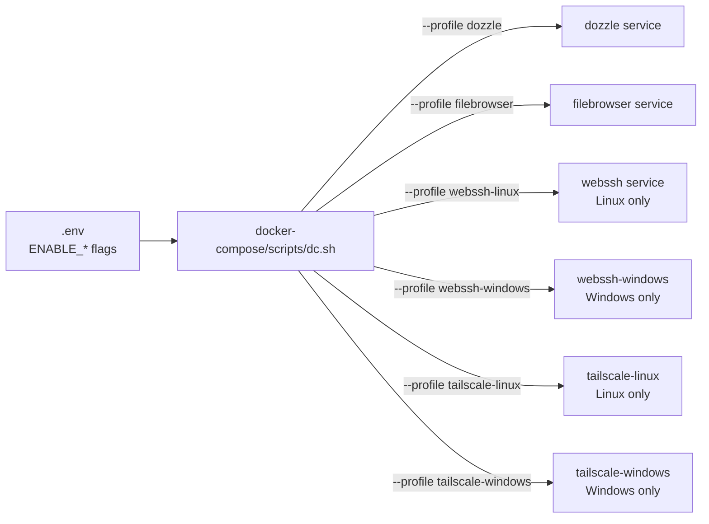
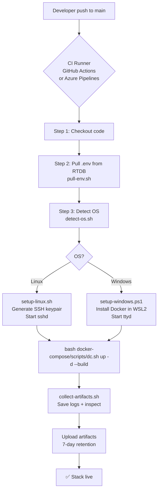
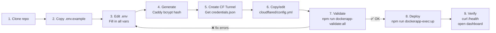
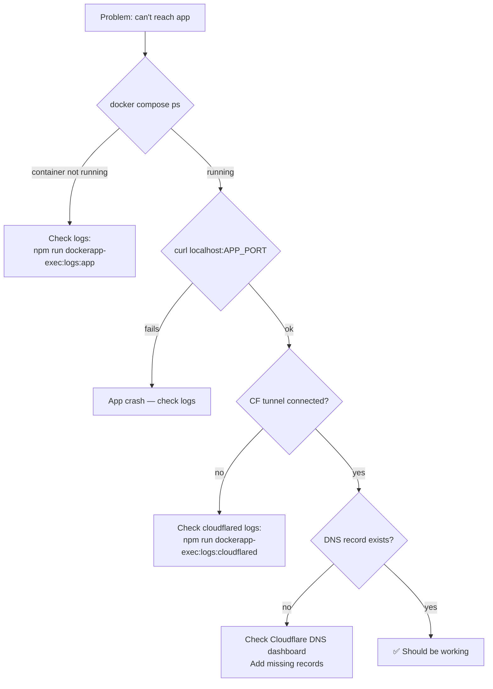

# Deployment Guide — Docker Stack Template

> Version 2.0 · Modular multi-service compose architecture

---

## Overview

This template provides a **drop-in Docker Compose stack** for deploying any containerized application with production-grade infrastructure already wired up: reverse proxy, tunnel, VPN access, log viewer, file browser, and web terminal — all controlled by feature flags in a single `.env` file.

```
┌─────────────────────────────────────────────────────┐
│            docker-compose/compose.core.yml          │
│   caddy (reverse proxy) + cloudflared (tunnel)      │
├──────────────────┬──────────────────────────────────┤
│ docker-compose/compose.ops.yml │ docker-compose/compose.access.yml │
│ dozzle           │ tailscale-linux                  │
│ filebrowser      │ tailscale-windows                │
│ webssh           ├──────────────────────────────────┤
│ webssh-windows   │ compose.apps.yml                 │
│                  │ app (your image)                 │
└──────────────────┴──────────────────────────────────┘
```

---

## Architecture

### Request Flow (Internet → App)

```mermaid
flowchart TD
    User([👤 Internet User]) -->|HTTPS| CF[☁️ Cloudflare Edge\nWAF · DDoS · Cache]
    CF -->|Encrypted tunnel| CFD[cloudflared\ncontainer]
    CFD -->|http://caddy:80| CADDY[Caddy\nReverse Proxy]
    CADDY -->|/| APP[app\ncontainer]
    CADDY -->|logs.*| DOZ[dozzle]
    CADDY -->|files.*| FB[filebrowser]
    CADDY -->|ttyd.*| SSH[webssh]

    subgraph docker["Docker network: ${STACK_NAME}_net"]
        CFD
        CADDY
        APP
        DOZ
        FB
        SSH
    end

    TEAM([👥 Internal Team]) -->|Tailscale VPN + HTTPS| TS[Tailscale]
    TS -->|https://${STACK_NAME}.${TAILSCALE_TAILNET_DOMAIN}| CADDY
```

### Subdomain Convention (auto-generated)

All subdomains are derived from `PROJECT_NAME` + `DOMAIN` — no manual `SUBDOMAIN_*` vars needed:

| Service     | URL                               | Controlled by             |
| ----------- | --------------------------------- | ------------------------- |
| App         | `${PROJECT_NAME}.${DOMAIN}`       | always on                 |
| Dozzle logs | `logs.${PROJECT_NAME}.${DOMAIN}`  | `ENABLE_DOZZLE=true`      |
| Filebrowser | `files.${PROJECT_NAME}.${DOMAIN}` | `ENABLE_FILEBROWSER=true` |
| WebSSH      | `ttyd.${PROJECT_NAME}.${DOMAIN}`  | `ENABLE_WEBSSH=true`      |

### Profile → Feature Flag Mapping



### CI/CD Deploy Flow



---

## Quick Start

### Step-by-step flow



### Commands

```bash
# 1. Clone
git clone <repo-url>
cd docker-stack-template

# 2. Configure
cp .env.example .env
# Edit .env with your values

# 3. Generate bcrypt hash for Caddy auth
docker run --rm caddy:alpine caddy hash-password --plaintext "YourPassword"
# → Copy output into CADDY_AUTH_HASH exactly as-is, wrapped in single quotes

# 4. Set up Cloudflare Tunnel
#    a. Create tunnel: https://one.dash.cloudflare.com → Zero Trust → Networks → Tunnels
#    b. Download credentials.json → place as cloudflared/credentials.json
#    c. Copy and edit the ingress config template:
cp cloudflared/config.yml.example cloudflared/config.yml
#    d. Set the tunnel ID and hostnames to match your DNS records

# 5. Validate everything
npm run dockerapp-validate:all

# 6. Deploy
npm run dockerapp-exec:up

# 7. Check status
npm run dockerapp-exec:ps
npm run dockerapp-exec:logs
```

---

## Configuration Reference

### Core env vars

| Variable          | Required | Default   | Description                                                                     |
| ----------------- | -------- | --------- | ------------------------------------------------------------------------------- |
| `STACK_NAME`      | ✅       | `mystack` | Docker network name prefix, Tailscale hostname                                  |
| `PROJECT_NAME`    | ✅       | —         | Subdomain prefix, e.g. `gitea` → `gitea.example.com`                            |
| `DOMAIN`          | ✅       | —         | Root domain, e.g. `example.com`                                                 |
| `CADDY_EMAIL`     | ✅       | —         | Email for Let's Encrypt SSL                                                     |
| `CADDY_AUTH_USER` | ✅       | `admin`   | Basic auth username                                                             |
| `CADDY_AUTH_HASH` | ✅       | —         | Bcrypt hash, stored exactly as generated and wrapped in single quotes in `.env` |

### Application vars

| Variable        | Required | Default          | Description                                          |
| --------------- | -------- | ---------------- | ---------------------------------------------------- |
| `APP_IMAGE`     | ✅       | `node:20-alpine` | Docker image to deploy                               |
| `APP_PORT`      | ✅       | `3000`           | Container-internal port                              |
| `APP_HOST_PORT` | ❌       | `3000`           | Localhost-only port published for direct HTTP access |
| `HEALTH_PATH`   | ❌       | `/health`        | Healthcheck endpoint                                 |
| `NODE_ENV`      | ❌       | `production`     | Runtime environment                                  |

### Feature flags

| Variable             | Default | Effect                           |
| -------------------- | ------- | -------------------------------- |
| `ENABLE_DOZZLE`      | `true`  | Real-time log viewer at `logs.*` |
| `ENABLE_FILEBROWSER` | `true`  | File manager at `files.*`        |
| `ENABLE_WEBSSH`      | `true`  | Web terminal at `ttyd.*`         |
| `ENABLE_TAILSCALE`   | `false` | Internal VPN access              |

### Tailscale vars (only when `ENABLE_TAILSCALE=true`)

| Variable                  | Required          | Description                                                        |
| ------------------------- | ----------------- | ------------------------------------------------------------------ |
| `TAILSCALE_AUTHKEY`       | ✅                | Auth key from Tailscale admin console                              |
| `TAILSCALE_TAILNET_DOMAIN`| ✅                | Tailnet DNS suffix (`*.ts.net`) used to build internal HTTPS host  |
| `TAILSCALE_TAGS`          | ❌                | ACL tags, default `tag:container`                                  |
| `TS_API_KEY`              | For `validate:ts` | API key for expiry check                                           |

For internal HTTPS via Tailscale:

- Internal HTTPS hostname is now derived automatically as `${STACK_NAME}.${TAILSCALE_TAILNET_DOMAIN}`.
- Trust Caddy's local root CA from `/data/caddy/pki/authorities/local/root.crt` if clients should accept the certificate without warnings.
- On Windows/Docker Desktop, the simplest path is usually to run Tailscale on the host so the published `443` port is reachable over the tailnet.
- The stack keeps public tunnel origins on plain `http://...`, while the dedicated tailnet hostname is served separately over `https://...` with `tls internal`.

---

## Use Cases

### Deploy Gitea

```env
STACK_NAME=gitea-prod
PROJECT_NAME=gitea
DOMAIN=example.com
APP_IMAGE=gitea/gitea:1.21
APP_PORT=3000
ENABLE_TAILSCALE=false
ENABLE_WEBSSH=false
```

Result: `gitea.example.com` → Gitea, `logs.gitea.example.com` → Dozzle

---

### Deploy Grafana with all ops tools

```env
STACK_NAME=monitoring
PROJECT_NAME=grafana
DOMAIN=example.com
APP_IMAGE=grafana/grafana:latest
APP_PORT=3000
ENABLE_DOZZLE=true
ENABLE_FILEBROWSER=true
ENABLE_WEBSSH=true
ENABLE_TAILSCALE=true
```

Result:

- `grafana.example.com` → Grafana
- `logs.grafana.example.com` → Dozzle
- `files.grafana.example.com` → Filebrowser
- `ttyd.grafana.example.com` → WebSSH

---

### Deploy custom built app

```yaml
# In compose.apps.yml, replace image with build:
services:
  app:
    build:
      context: ./services/app
      dockerfile: Dockerfile
    # remove "image:" line
```

---

## NPM Script Reference

```
Validation:
  npm run dockerapp-validate:all     Run all checks (env + compose + TS)
  npm run dockerapp-validate:env     Check required env vars + format
  npm run dockerapp-validate:compose Validate merged Docker Compose YAML
  npm run dockerapp-validate:ts      Check Tailscale auth key format + expiry

Helpers:
  npm run dockerapp-gen:caddy-hash   Print bcrypt hash (pass password as arg)

Docker control:
  npm run dockerapp-exec:up               Build + start all enabled services
  npm run dockerapp-exec:up:fresh         Wipe volumes + full rebuild
  npm run dockerapp-exec:down             Stop all services
  npm run dockerapp-exec:down:volumes     Stop + delete volumes
  npm run dockerapp-exec:restart          Restart all services
  npm run dockerapp-exec:restart:app      Restart app service only
  npm run dockerapp-exec:ps               Show container status
  npm run dockerapp-exec:logs             Follow all logs
  npm run dockerapp-exec:logs:app         Follow app logs only
  npm run dockerapp-exec:config           Print merged compose YAML
  npm run dockerapp-exec:prune            Remove unused Docker images
```

---

## Compose File Structure

```
docker-stack-template/
├── docker-compose/
│   ├── compose.core.yml      ← always-on infrastructure
│   ├── compose.ops.yml       ← feature-flagged ops tools
│   ├── compose.access.yml    ← feature-flagged VPN
│   └── scripts/
│       ├── dc.sh             ← compose orchestrator (reads .env flags)
│       ├── up.sh             ← shortcut: build + start
│       ├── down.sh           ← shortcut: stop
│       ├── logs.sh           ← shortcut: follow logs
│       ├── validate-env.js   ← env completeness + format check
│       ├── validate-ts.js    ← Tailscale auth key check
│       └── validate-compose.js ← docker compose config validation
├── compose.apps.yml      ← your application
├── .env.example          ← reference config
├── package.json          ← npm script runner
├── cloudflared/
│   ├── config.yml        ← manually maintained tunnel ingress config
│   └── config.yml.example ← starting template
└── services/
    ├── app/              ← custom Node.js app (optional)
    └── webssh/           ← ttyd SSH container
```

---

## Security Checklist

Before going live:

- [ ] `CADDY_AUTH_HASH` is a strong bcrypt hash (not placeholder)
- [ ] `cloudflared/credentials.json` is NOT in git (`.gitignore` covers it)
- [ ] `.env` is NOT in git
- [ ] Filebrowser mounts `./logs` read-only (`:ro` flag)
- [ ] WebSSH is behind Caddy basic auth
- [ ] Admin tools (`logs.*`, `files.*`, `ttyd.*`) only accessible via VPN or Cloudflare Access
- [ ] Image versions are pinned (not `:latest`)
- [ ] `TAILSCALE_AUTHKEY` is a short-lived reusable key with appropriate ACL tags

---

## Troubleshooting

### Container not reachable after deploy



### Common errors

| Error                     | Cause                              | Fix                                                                |
| ------------------------- | ---------------------------------- | ------------------------------------------------------------------ |
| `ERROR: .env not found`   | Missing `.env`                     | `cp .env.example .env`                                             |
| `invalid bcrypt hash`     | Wrong `CADDY_AUTH_HASH` format     | Re-generate and store it exactly as generated inside single quotes |
| `tunnel not connected`    | Bad `cloudflared/credentials.json` | Re-download from CF dashboard                                      |
| Container in `Restarting` | App crash on startup               | Check `npm run dockerapp-exec:logs:app`                            |
| `profile not found`       | Old Docker Compose version         | Upgrade to Compose v2+                                             |

---

## Adding a New Service

To add a new service behind Caddy:

```yaml
# In compose.apps.yml or a new compose.myservice.yml:

services:
  myservice:
    image: myimage:1.0
    labels:
      - "caddy=http://api.${PROJECT_NAME}.${DOMAIN}"
      - "caddy.reverse_proxy={{upstreams 8080}}"
      - "caddy.basic_auth=/*"
      - "caddy.basic_auth.${CADDY_AUTH_USER:-admin}=${CADDY_AUTH_HASH}"
    networks: [app_net]
    restart: unless-stopped
```

Then add the hostname to `cloudflared/config.yml`:

```yaml
- hostname: api.${PROJECT_NAME}.${DOMAIN}
  service: http://caddy:80
```

Then update `cloudflared/config.yml` manually to add the matching ingress rule.
